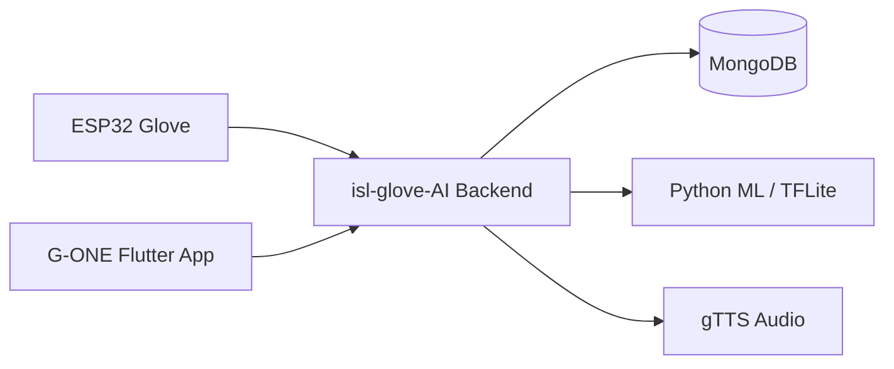

# ISL Glove AI System (G-ONE)


Indian Sign Language (ISL) smart-glove platform: a **Flutter mobile app** talks to a **single Node.js + Python backend** that ingests glove sensor data, runs ML inference, stores results in MongoDB, and generates speech audio.

For deeper technical detail, see [PROJECT_INFORMATION.md](PROJECT_INFORMATION.md).

---

## Table of Contents

- [Overview](#overview)
- [Architecture](#architecture)
- [Project Structure](#project-structure)
- [Prerequisites](#prerequisites)
- [Quick Start](#quick-start)
- [Run the Backend](#run-the-backend)
- [Run the Flutter App](#run-the-flutter-app)
- [ML Model](#ml-model)
- [Run with Docker](#run-with-docker)
- [Documentation](#documentation)
- [Contributing](#contributing)

---

## Overview

**G-ONE** connects an ESP32-based ISL glove to a mobile app. The glove streams flex, accelerometer, and gyroscope readings; the backend buffers them per device, predicts the signed character when a gesture ends, converts the result to speech, and returns JSON plus an audio URL to the app.

There is **one backend service** (`isl-glove-AI`). There is no RabbitMQ, no Traefik, and no separate TTS microservice — prediction and text-to-speech run inside the same API.

---

## Architecture



**Flow**

1. ESP32 posts sensor timesteps to `POST /api/sensors`.
2. Backend buffers readings per `deviceId` until `end: true`.
3. On `end`, the backend runs inference (`ml/model.tflite`) and generates speech.
4. The Flutter app polls or displays the latest prediction and plays the audio URL.

---

## Project Structure

```
ISL_APP/
├── app/                      # G-ONE Flutter mobile application
├── isl-glove-AI/             # Single backend (Node.js API + Python ML)
│   ├── ml/                   # Training scripts + model.tflite (included)
│   ├── src/                  # Express routes, services, models
│   ├── server.js
│   ├── Dockerfile
│   └── example.env
├── docker-compose.local.yml  # Local Docker (backend only)
├── docker-compose.prod.yml   # Production Docker (backend only)
├── PROJECT_INFORMATION.md    # Detailed project reference
└── README.md
```

---

## Prerequisites

| Tool | Version | Required for |
|------|---------|--------------|
| Node.js | 18+ | Backend |
| Python | **3.10** (not 3.12) | ML inference & training |
| MongoDB | 6+ | Database |
| Flutter | 3.x | Mobile app |
| Docker | Optional | Containerized backend |

---

## Quick Start

Minimal path to run everything locally (model file is **already included** — no training required):

### 1. Clone the repository

```bash
git clone <your-repository-url>
cd ISL_APP
```

### 2. Start MongoDB

Run MongoDB locally on the default port:

```bash
# Default connection used by the backend:
# mongodb://127.0.0.1:27017/isl_glove
```

### 3. Start the backend

```bash
cd isl-glove-AI
cp example.env .env
npm install
pip install -r requirements.txt
npm run dev
```

API listens on **http://localhost:5000**.

### 4. Run the Flutter app

```bash
cd app
flutter pub get
flutter run
```

Update the API URL in `app/lib/utils/constants.dart` if your backend is not on the default host.

---

## Run the Backend

### Environment setup

```bash
cd isl-glove-AI
cp example.env .env
```

Edit `.env` as needed:

| Variable | Description |
|----------|-------------|
| `PORT` | API port (default `5000`) |
| `MONGO_URI` | MongoDB connection string |
| `MODEL_PATH` | Path to TFLite model (`ml/model.tflite`) |
| `PYTHON_PATH` | Python executable (`python` or `py -3.10`) |
| `JWT_SECRET` | Secret for auth tokens |
| `PUBLIC_BASE_URL` | Public URL for audio links (e.g. `http://localhost:5000` or ngrok URL) |

### Install dependencies

```bash
npm install
pip install -r requirements.txt
```

On Windows, use a Python 3.10 virtual environment:

```powershell
py -3.10 -m venv venv
.\venv\Scripts\activate
pip install -r requirements.txt
```

### Start the server

```bash
# Development (auto-reload)
npm run dev

# Production
npm start
```

Health check: server logs `Server running on port 5000`.

---

## Run the Flutter App

### Development

```bash
cd app
flutter pub get
flutter run
```

Connect a physical Android device or start an emulator before running.

### Release APK build

```bash
cd app
flutter pub get
flutter build apk --release --no-tree-shake-icons
```

The APK is written to:

```
app/build/app/outputs/flutter-apk/app-release.apk
```

Set the backend URL in `app/lib/utils/constants.dart` (`baseUrl`) before building for a device that cannot reach `localhost`.

---

## ML Model

A trained **`model.tflite`** is already present in `isl-glove-AI/ml/`. For normal development and deployment you **do not need to run training** — the backend loads this file for inference.

### Regenerate the model (optional)

Only follow these steps if you have new sensor data in MongoDB and want to retrain:

1. **Python 3.10 environment**

   ```bash
   cd isl-glove-AI
   py -3.10 -m venv venv
   venv\Scripts\activate        # Windows
   # source venv/bin/activate   # macOS / Linux
   pip install -r requirements.txt
   ```

2. **Sensor data in MongoDB** — training reads from the `sensorwindows` collection. You can seed sample data:

   ```bash
   cd ml
   python seed_mock_data.py
   ```

3. **Train and export**

   ```bash
   python train.py
   ```

   This produces (among others):

   - `autoencoder_model.h5`
   - `gesture_model.h5`
   - `normalizer.npz`
   - `labels.json`
   - `model.tflite`

4. Restart the backend so it picks up the new `model.tflite`.

> **Note:** Do not run training in production containers. Training is a one-off offline step; production uses only the exported TFLite model.

---

## Run with Docker

Docker runs **only the backend** container. MongoDB must be available separately (local install, Atlas, or another container).

### Local development

1. Create the Docker network (once):

   ```bash
   docker network create isl-network
   ```

2. Ensure MongoDB is running on the host at port `27017`.

3. Start the backend:

   ```bash
   docker compose -f docker-compose.local.yml up --build
   ```

   The compose file connects to host MongoDB via `host.docker.internal`. Override with a `.env` file or shell variable:

   ```bash
   MONGO_URI=mongodb://host.docker.internal:27017/isl_glove docker compose -f docker-compose.local.yml up --build
   ```

API: **http://localhost:5000**

### Production

Set required environment variables, then:

```bash
export MONGO_URI="mongodb+srv://<user>:<pass>@<cluster>/isl_glove"
export JWT_SECRET="your-strong-secret"
export PUBLIC_BASE_URL="https://api.yourdomain.com"

docker compose -f docker-compose.prod.yml up --build -d
```

---

## Documentation

| Document | Description |
|----------|-------------|
| [EXTERNAL_GESTURE_DEVICE.md](EXTERNAL_GESTURE_DEVICE.md) | External laptop — gesture API + sensor socket integration |
| [PROJECT_INFORMATION.md](PROJECT_INFORMATION.md) | Full project reference — APIs, env vars, data flow |
| [isl-glove-AI/README.md](isl-glove-AI/README.md) | Backend & ML pipeline details |
| [app/README.md](app/README.md) | Flutter app overview |

---

## Contributing

1. Fork the repository.
2. Create a branch: `git switch -c <username>-feature`
3. Make your changes and commit.
4. Open a Pull Request.

**Authors:** 1129Aliasgar, faizansk25, meetagrawal12, roshnishaikh2105-cloud
