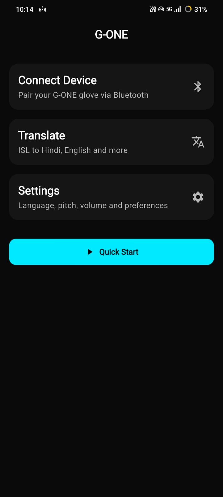
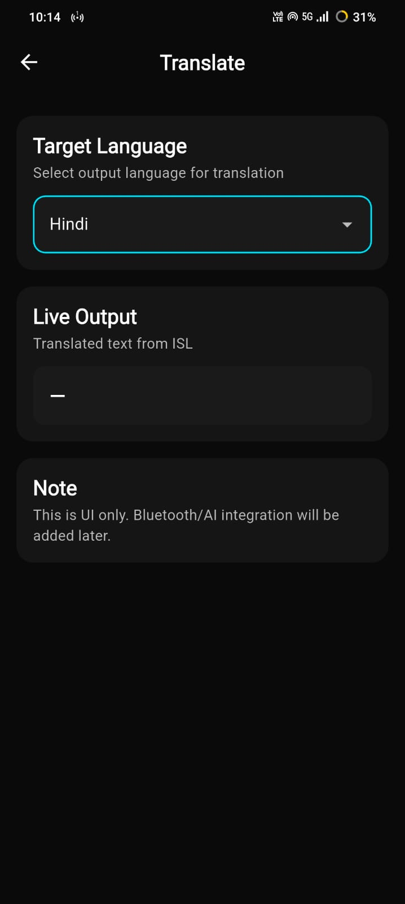

# g_one

- G-One is a Flutter-based mobile application that translates Indian Sign Language (ISL) into multiple spoken and written languages such as Hindi, Marathi, English, and more.

- The app integrates with a smart glove that captures sign inputs and converts them into meaningful text and speech in the selected language.

- Glove Connectivity – Connect your ISL glove with the app for real-time translation.

- Multi-language Support – Translate ISL into Hindi, Marathi, English, and more.

- Customizable Speech Output – Adjust the pitch of the translated speech via the settings menu.

- Cross-platform Support – Works seamlessly on Android (iOS support planned).

# How to start APP 

- Clone repo using `git clone 'past repo link here'` .
- After cloning `cd g_one` .
- Connect your physical device/emulator
- Run Flutter run 

# Projet Structure 

g_one/
├── lib/              # Main application code
├── android/          # Android-specific code
├── ios/              # iOS-specific code (future support)
├── assets/           # Images, icons, and other assets
├── pubspec.yaml      # Dependencies
└── README.md         # Project documentation

# Future Enhancement 

- Add NLP to transale languages 

- Enable cloud-based processing for faster translations.

- Improve speech synthesis with natural voice tones.

# Tech Stack

- Framework: Flutter (Dart)

- Backend / Processing: (Node js)

- Hardware Integration: ISL smart glove

# Contributing

- Contributions, issues, and feature requests are welcome!

- Feel free to fork this repo and submit a pull request.

# Images :

- [ ] 
- [ ] 
- [ ] 
- [ ] 
- [ ] 
